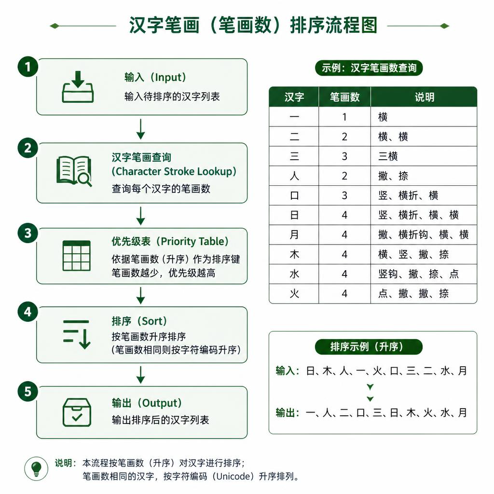
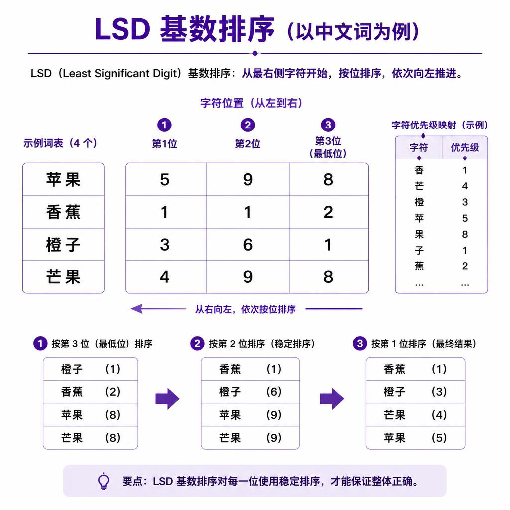
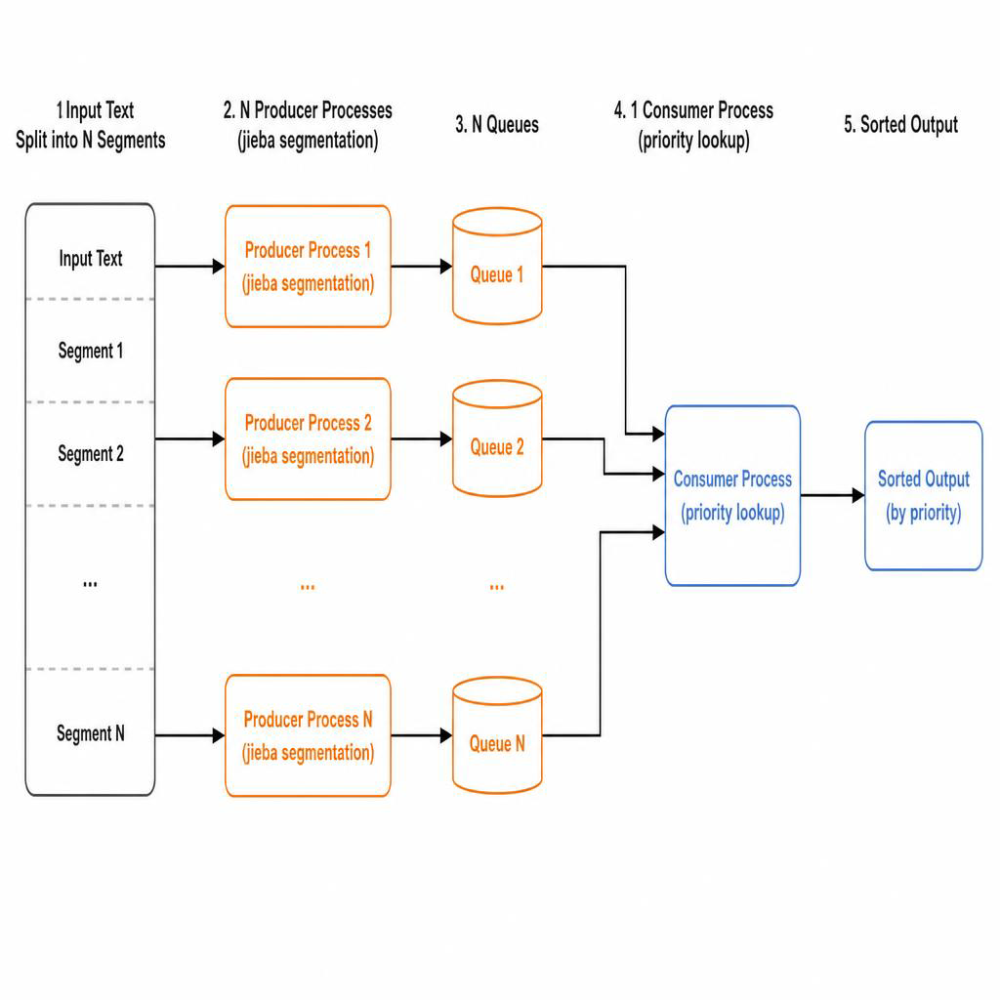
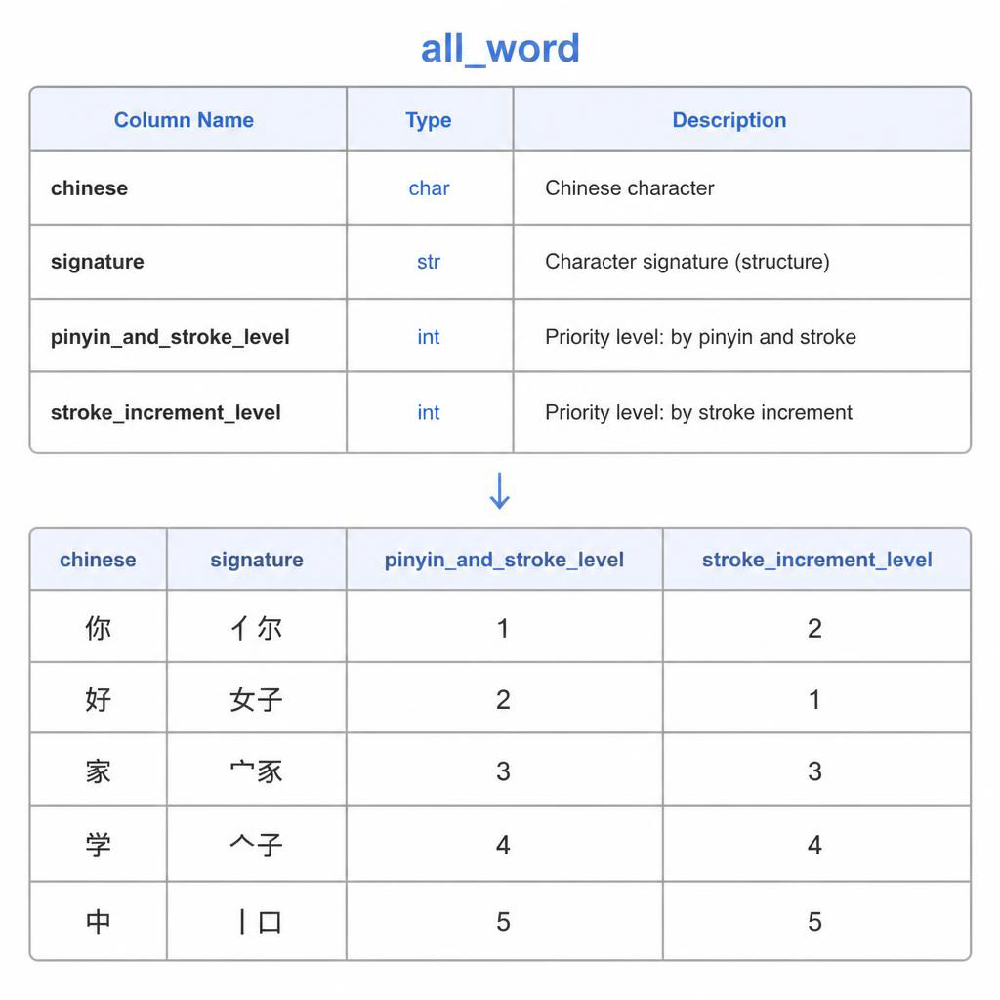
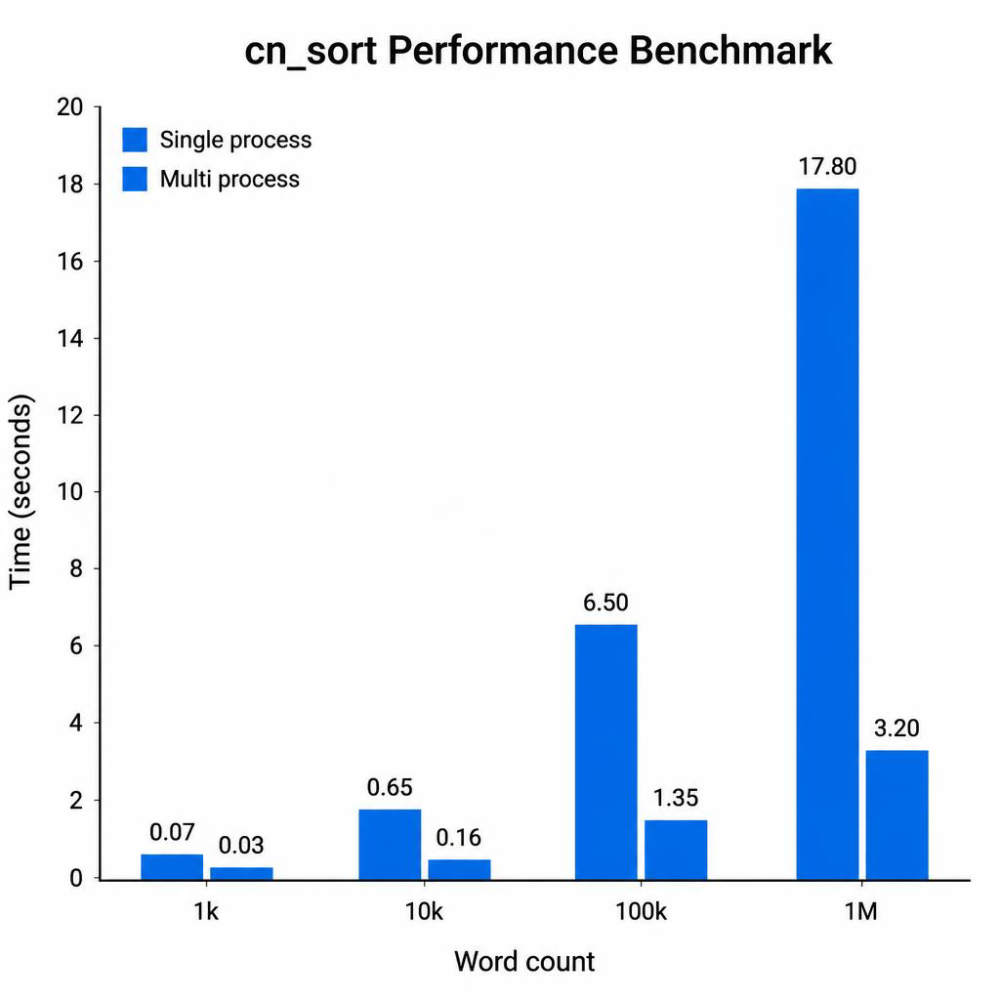

# cn_sort

[](https://pypi.org/project/cn-sort/)
[](https://pypi.org/project/cn-sort/)
[](https://opensource.org/licenses/MIT)
[](https://pypi.org/project/cn-sort/)

**按拼音和笔顺精确、快速排序大量简体中文词组。**

支持百万数量级排序，有效解决多音字混排问题，中英文混用词组同样适用。


---

## Features

- **两种排序模式**：拼音+笔顺（默认）或纯笔顺
- **多音字智能处理**：基于上下文自动区分多音字优先级（如"重庆"和"重要"）
- **大规模多进程加速**：词组量超过阈值时自动切换多进程模式
- **中英文混排**：非中文字符（字母、数字、标点）排在汉字前面
- **简单易用**：一行代码完成排序

---

## Installation

```bash
pip install cn-sort
```

---

## Quick Start

```python
from cn_sort import sort_text_list, Mode

# 按拼音排序（默认）
words = ['唯依', '唯衣', '唯一', '啊']
result = sort_text_list(words)
print(result)  # ['啊', '唯一', '唯衣', '唯依']

# 按笔顺排序
result = sort_text_list(['三', '二', '一', '一二'], mode=Mode.BIHUA)
print(result)  # ['一', '一二', '二', '三']

# 多音字自动处理
result = sort_text_list(['重要', '重庆'])
print(result)  # ['重庆', '重要']
```

---

## Sorting Modes

| Mode | Description | Example Input | Example Output |
|------|-------------|--------------|----------------|
| `Mode.PINYIN` | 按拼音再按笔顺（默认） | `['三','一','二']` | `['二','三','一']`（er < san < yi） |
| `Mode.BIHUA` | 仅按笔顺 | `['三','一','二']` | `['一','二','三']`（1画<2画<3画） |

### Pinyin Sort Flow


### Stroke Order Sort



---

## API Reference

### `sort_text_list(text_list, freeze=False, threshold=100000, mode=Mode.PINYIN)`

对汉字词组列表排序。

| Parameter | Type | Default | Description |
|-----------|------|---------|-------------|
| `text_list` | `list[str]` | — | 待排序词组列表 |
| `freeze` | `bool` | `False` | Windows 下非 `if __name__ == '__main__'` 调用时设 `True` |
| `threshold` | `int` | `100000` | 超过此数量时启用多进程 |
| `mode` | `Mode` | `Mode.PINYIN` | 排序模式 |

**Returns:** 排序后的 `list[str]`

### `set_stdout_level(level)`

设置终端日志输出级别。`level` 可选：`"DEBUG"` / `"INFO"` / `"WARN"` / `"ERROR"` / `"CRITICAL"`。

---

## How It Works

### 算法思路

cn_sort 基于**基数排序**（LSD Radix Sort），将词组转换为优先级整数数组，再逐列稳定排序。



1. **建立优先级表**：预先收集 2 万多个汉字的拼音与笔顺，生成 `all_word.json`（以空间换时间，哈希查询 O(1)）
2. **词→优先级元组**：每个词中每个字通过拼音签名（如 `人_ren2`）查表，得到整数优先级
3. **LSD 基数排序**：从最低位（最后一字）到最高位（第一字），逐列使用 Python timsort 稳定排序
4. **多音字处理**：`pypinyin` 结合词语上下文自动选择正确读音

### 多进程架构（大规模模式）

当词组数量超过 `threshold`（默认 10 万）时，自动启用多进程生产者-消费者架构：



- **生产者进程**（CPU 核数 - 1 个）：jieba 分词，过滤重复词，推入各自独立的 Queue
- **消费者进程**（1 个）：从所有队列收集词，批量查询优先级表，建立映射缓存
- **主进程**：汇总分段结果，应用映射，最终排序

### 优先级表结构



---

## Performance



- **小规模**（< 1000 词）：单进程，毫秒级
- **中规模**（1 万词）：约 0.18s
- **大规模**（100 万词）：启用多进程，利用全部 CPU 核心

### 多音字示例


---

## Dependencies

- [pypinyin](https://github.com/mozillazg/python-pinyin) — 汉字转拼音（含上下文多音字识别）
- [jieba](https://github.com/fxsjy/jieba) — 中文分词（大规模模式下使用）

---

## Contributing

欢迎提交 Issue 和 Pull Request！

1. Fork 本仓库
2. 创建功能分支：`git checkout -b feature/your-feature`
3. 提交修改：`git commit -m 'feat: add your feature'`
4. 推送分支：`git push origin feature/your-feature`
5. 开启 Pull Request

---

## License

MIT License. See [LICENSE](LICENSE) for details.
